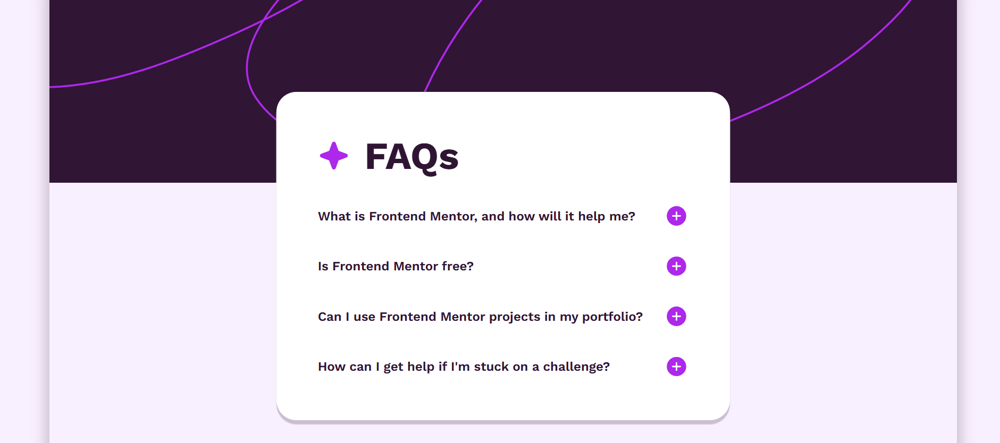
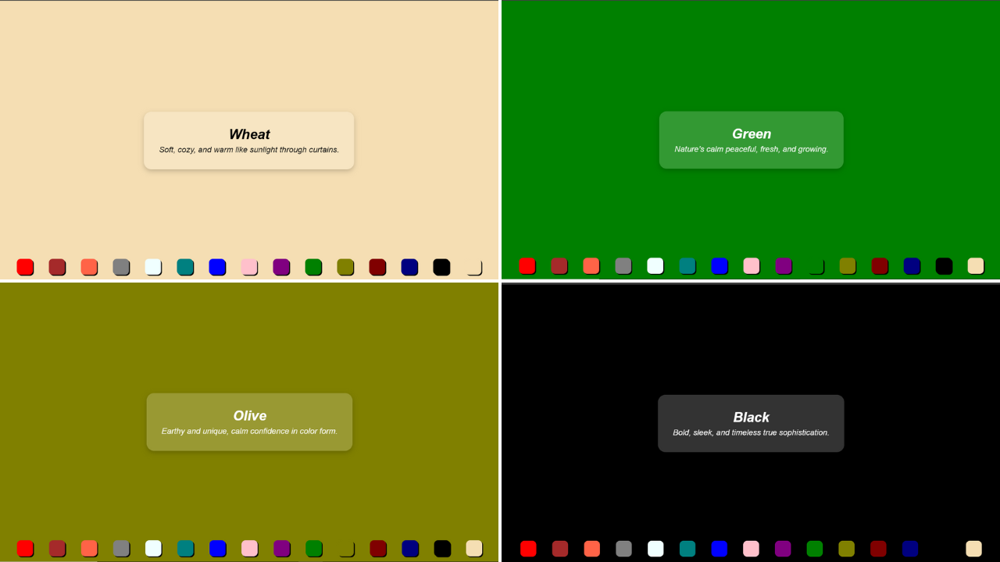

# Hi, I'm Ayesha Latif

I am an Information Technology graduate with hands-on experience in web development, databases, and application development. My experience includes building web applications, working with data, and developing practical software solutions. I am expanding my skills in  Artificial Intelligence, with a focus on applying machine learning techniques, and building practical AI-powered applications. Through independent learning and project-based practice, I aim to strengthen my technical skills and explore opportunities at the intersection of web development and AI.

## Contact

[LinkedIn](https://linkedin.com/in/ayeshalatif111) | [Email](ayeshalatifchoudhery@gmail.com)

## Featured Projects

### Explain My Learning Risk
An explainable early-warning prototype that estimates whether a student may be at risk of poor academic performance and explains the estimate in simple educational language.

Focus: Build a student-performance prediction prototype. It should accept student information, predict a performance/risk category, identify the main factors influencing that result, and present those factors in simple educational language

[View Repository](https://github.com/ayeshalatif1/explain-my-learning-risk) | [Live Demo](https://explain-my-learning-risk.streamlit.app/)

### Tech Stack 
Python, 
Pandas, Numpy,
scikit-learn (logistic regression),
matplotlib,
joblib,
Streamlit,
SHAP

  

### Sunny Side Agency Landing Page  
A responsive and clean Sunny Side Agency Landing Page built with HTML, CSS, and JavaScript. The layout adapts seamlessly to different screen sizes, with a dynamic menu optimized for mobile devices.

Focus: Implementing responsive design techniques and using JavaScript to create a mobile-friendly navigation menu. 

### Tech Stack: React + Vite, CSS

[View Repository](https://github.com/ayeshalatif1/LANDING-PAGE-SUNNYSIDE-AGENCY-) | [Live Demo](https://ayeshalatif1.github.io/LANDING-PAGE-SUNNYSIDE-AGENCY-/)
 
### FAQ Accordion
An interactive FAQ Accordion built with HTML, CSS, and JavaScript. It allows users to expand or collapse questions smoothly, providing a clean and responsive way to display FAQs.

Focus: Using JavaScript to toggle content visibility and implementing a responsive, user-friendly accordion layout.

  

[View Repository](https://github.com/ayeshalatif1/FAQ-ACCORDION) | [Live Demo](https://ayeshalatif1.github.io/FAQ-ACCORDION/)

### Tic Tac Toe Game  
A classic Tic Tac Toe Game built with HTML, CSS, and JavaScript. Players can enjoy a simple, interactive interface with real-time win detection and reset functionality.

Focus: Implementing game logic with JavaScript, handling player turns, and dynamically updating the UI based on game outcomes.

  

[View Repository](https://github.com/ayeshalatif1/Tic-Tac-Toe-Game) | [Live Demo](https://ayeshalatif1.github.io/Tic-Tac-Toe-Game/)

### Background Color Changer  
A small web app that dynamically changes background colors with smooth transitions on user click.  

Focus: Implementation of state management for smooth transition and object manipulation to display relevent color name and description.  

  

[View Repository](https://github.com/ayeshalatif1/backgroundColorChanger) | [Live Demo](https://ayeshalatif1.github.io/backgroundColorChanger/)

### Tip Calculator
A responsive Tip Calculator built with React that helps users easily calculate the tip amount and total bill per person.

Focus: Using React hooks like useState, and useEffect for dynamic calculations and building a clean, user-friendly interface.

  

[View Repository](https://github.com/ayeshalatif1/Tip-Calculator/) | [Live Demo](https://ayeshalatif1.github.io/Tip-Calculator/)

### Currency Converter
A Currency Converter built with React that allows users to convert between different currencies using real-time exchange rates.

Focus: Fetching live data from an API and using React state management to update conversion results dynamically.

  

[View Repository](https://github.com/ayeshalatif1/currencyConverter) | [Live Demo](https://ayeshalatif1.github.io/currencyConverter/)

## Technical Skills

Programming Languages: React, HTML, CSS, JavaScript, C++

Database: MySQL, SQL Server  

Tools: Git, GitHub, VS Code

Other: APIs, JSON, Responsive Web Design, Tailwind CSS

## Highlights

- Experienced in translating **UI/UX designs into clean, maintainable code**  
- Skilled in **responsive layouts** and **component-based development**  
- Familiar with **API integration**, **state management**, and **data validation**  
- Continuously improving skills in web frameworks and clean coding practices  

