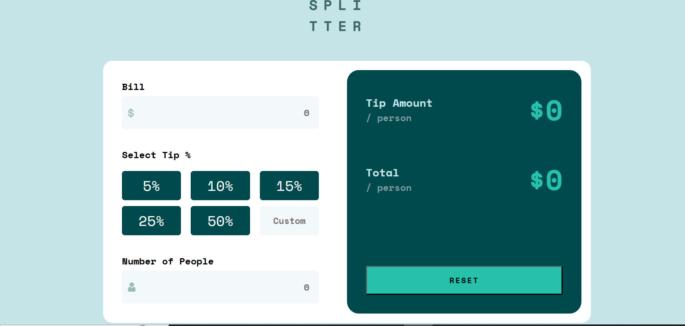

# Hi, I'm Ayesha Latif

I’m a passionate web developer learning modern tools and techniques by working on various self-driven web development projects. My projects also include converting a UI design into pixel-perfect HTML/React code, using custom CSS, and applying frameworks like Bootstrap and Tailwind CSS. Currently, I’m focusing on adding interactivity to websites, improving performance optimization, and expanding my knowledge of full-stack technologies.

I’m seeking opportunities where I can apply my skills to contribute effectively to an organization’s goals while continuing to learn and grow in the field.

## Contact

[GitHub](https://github.com/ayeshalatif1) | [LinkedIn](https://linkedin.com/in/ayeshalatif111) | [Email](ayeshalatif223@gmail.com)

## Education

Bachelor’s in Information Technology  

University: Mirpur University of Science & Technology

Year of Graduation: 2024

CGPA: 3.55

## Featured Projects

Tech Stack : HTML, CSS, javaScript

### FAQ Accordion
An interactive FAQ Accordion built with HTML, CSS, and JavaScript. It allows users to expand or collapse questions smoothly, providing a clean and responsive way to display FAQs.

Focus: Using JavaScript to toggle content visibility and implementing a responsive, user-friendly accordion layout.

  

[View Repository](https://github.com/ayeshalatif1/FAQ-ACCORDION) | [Live Demo](https://ayeshalatif1.github.io/FAQ-ACCORDION/)

### Advice Generator App  
A responsive app that generates unique advice on every refresh and button click.  

Focus: Implemented project using Advice Slip API and experienced how to manipulate DOM and implement event listeners.  

  

[View Repository](https://github.com/ayeshalatif1/ADVICE-GENERATOR-APP) | [Live Demo](https://ayeshalatif1.github.io/ADVICE-GENERATOR-APP/)

### Tic Tac Toe Game  
A classic Tic Tac Toe Game built with HTML, CSS, and JavaScript. Players can enjoy a simple, interactive interface with real-time win detection and reset functionality.

Focus: Implementing game logic with JavaScript, handling player turns, and dynamically updating the UI based on game outcomes.

  

[View Repository](https://github.com/ayeshalatif1/Tic-Tac-Toe-Game) | [Live Demo](https://ayeshalatif1.github.io/Tic-Tac-Toe-Game/)

### Sunny Side Agency Landing Page  
A responsive and clean Sunny Side Agency Landing Page built with HTML, CSS, and JavaScript. The layout adapts seamlessly to different screen sizes, with a dynamic menu optimized for mobile devices.

Focus: Implementing responsive design techniques and using JavaScript to create a mobile-friendly navigation menu. 

[View Repository](https://github.com/ayeshalatif1/LANDING-PAGE-SUNNYSIDE-AGENCY-) | [Live Demo](https://ayeshalatif1.github.io/LANDING-PAGE-SUNNYSIDE-AGENCY-/)

### Tech Stack: React + Vite, CSS 

### Background Color Changer  
A small web app that dynamically changes background colors with smooth transitions on user click.  

Focus: Implementation of state management for smooth transition and object manipulation to display relevent color name and description.  

  

[View Repository](https://github.com/ayeshalatif1/backgroundColorChanger) | [Live Demo](https://ayeshalatif1.github.io/backgroundColorChanger/)

### Tip Calculator
A responsive Tip Calculator built with React that helps users easily calculate the tip amount and total bill per person.

Focus: Using React hooks like useState, and useEffect for dynamic calculations and building a clean, user-friendly interface.

  

[View Repository](https://github.com/ayeshalatif1/Tip-Calculator/settings/pages) | [Live Demo](https://ayeshalatif1.github.io/Tip-Calculator/)

### Currency Converter
A Currency Converter built with React that allows users to convert between different currencies using real-time exchange rates.

Focus: Fetching live data from an API and using React state management to update conversion results dynamically.

  

[View Repository](https://github.com/ayeshalatif1/currencyConverter) | [Live Demo](https://ayeshalatif1.github.io/currencyConverter/)

## Technical Skills

Programming Languages: React, HTML, CSS, JavaScript, C++

Database: MySQL, SQL Server  

Tools: Git, GitHub, VS Code

Other: APIs, JSON, Responsive Web Design, Tailwind CSS

## Highlights

- Experienced in translating **UI/UX designs into clean, maintainable code**  
- Skilled in **responsive layouts** and **component-based development**  
- Familiar with **API integration**, **state management**, and **data validation**  
- Continuously improving skills in web frameworks and clean coding practices  

